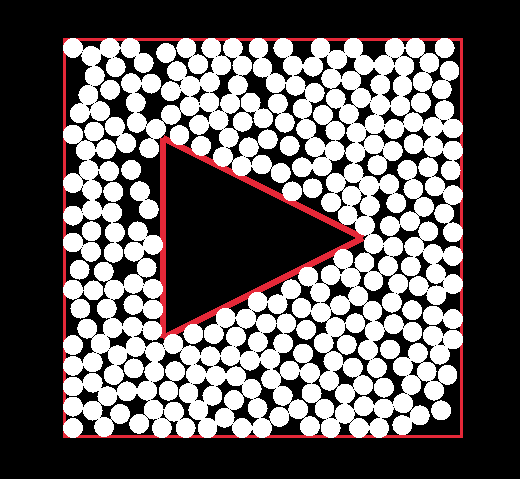

# Prism

**Prism** is a library for generating points in patterns within volumes.

```rs
Polygon::new()
        .add_rect(Vector2::new(100.0, 100.0), Vector2::new(200.0, 200.0))
        .add_polygon(&[
            Vector2::new(150.0, 150.0),
            Vector2::new(150.0, 250.0),
            Vector2::new(250.0, 200.0),
        ])
        .packed_points(5.0)
```


**Features:**
- Arbitrary-dimensional cuboid and sphere volumes.
- 2d multi-polygon volumes (with holes).
- Grid and white noise random point generation.
- [Random close packing](https://en.wikipedia.org/wiki/Random_close_pack) generation.
